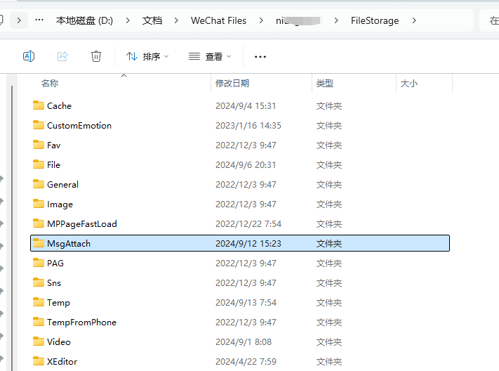
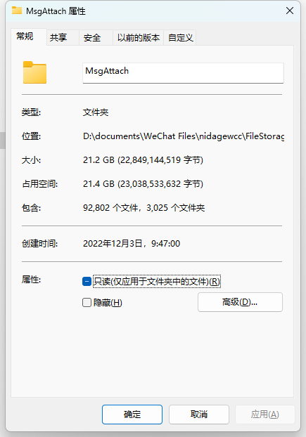
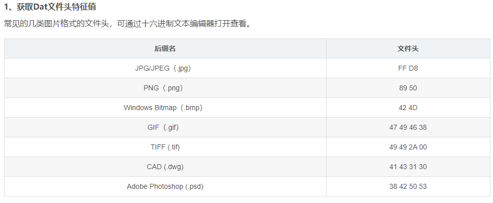
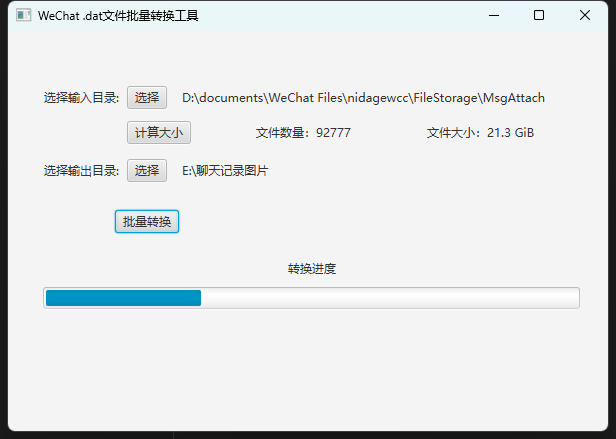

### 微信聊天记录中的图片文件解密&导出工具

起初是因为我的电脑存储只有500GB空间，而微信的聊天记录图片就占用了20多个GB。



存储空间不足，所以想把微信聊天记录中的图片文件解密后导出到本地，方便查看。

但是微信聊天记录中的图片都是经过加密存储的.dat文件，所以需要异或解密才行，根据每个图片文件的头文件格式


```java
// 计算异或值和格式（返回一个数组，第一个是异或值，第二个是格式）
private static byte[] calculateXorAndFormat(File datFile) {
    try (FileInputStream datInputStream = new FileInputStream(datFile)) {
        byte[][] formats = {
                {(byte) 0x89, (byte) 0x50, (byte) 0x4e},  // PNG
                {(byte) 0xff, (byte) 0xd8, (byte) 0xff},  // JPG
                {(byte) 0x47, (byte) 0x49, (byte) 0x46}   // GIF
        };

        byte[] header = new byte[3];
        if (datInputStream.read(header) != 3) {
            return null;
        }

        for (int j = 0; j < formats.length; j++) {
            byte[] formatHeader = formats[j];
            byte[] res = new byte[3];
            for (int i = 0; i < 3; i++) {
                res[i] = (byte) (header[i] ^ formatHeader[i]);
            }
            if (res[0] == res[1] && res[1] == res[2]) {
                return new byte[]{res[0], (byte) (j + 1)};
            }
        }
    } catch (IOException e) {
        System.err.println("读取文件头部信息失败: " + e.getMessage());
    }
    return null;
}
```


### 使用的JavaFX 库做的简单UI



